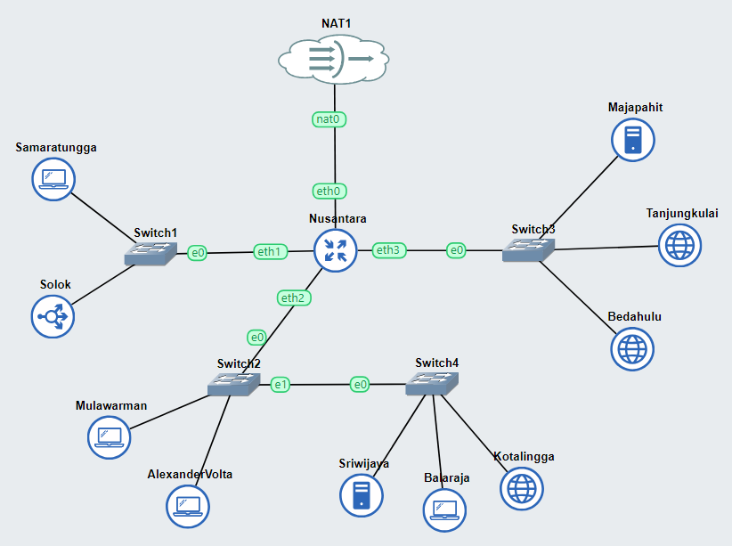

# Jarkom-Modul-2-IT16-2024

# Anggota

| Nama                            | NRP          |
| ------------------------------- | ------------ |
| Zidny Ilman Nafi'an | `5027221072` |
| MUHAMMAD DZAKWAN | `5027201065` |


# Setup Topologi


Buat topologi seperti di atas sesuai dengan yang ditentukan.

Ini bertujuan untuk membantu mengkonfigurasi dan memecahkan masalah transfer zona DNS antara server Master (Sriwijaya) dan server Slave (Majapahit) menggunakan BIND.

## 1. Setup node

Untuk membantu pertempuran di Erangel, kamu ditugaskan untuk membuat jaringan komputer yang akan digunakan sebagai alat komunikasi. Sesuaikan rancangan Topologi dengan rancangan dan pembagian yang berada di link yang telah disediakan, dengan ketentuan nodenya sebagai berikut :
1. DNS Master akan diberi nama Sriwijaya, sesuai dengan kota tempat dibuatnya server tersebut
2. Karena ada kemungkinan musuh akan mencoba menyerang Server Utama, maka buatlah DNS Slave Majapahit yang mengarah ke Sriwijaya
3. Markas pusat juga meminta dibuatkan dua Web Server yaitu Tanjungkulai, dan Bedahulu. Sedangkan Solok akan bertindak sebagai Load Balancer untuk server-server tersebut

Network Configuration tiap node seperti di bawah ini:

## Router

### Nusantara
```
auto eth0
iface eth0 inet dhcp

auto eth1
iface eth1 inet static
	address 192.241.1.1
	netmask 255.255.255.0

auto eth2
iface eth2 inet static
	address 192.241.2.1
	netmask 255.255.255.0

auto eth3
iface eth3 inet static
	address 192.241.3.1
	netmask 255.255.255.0
```

### Samaratungga

```
auto eth0
iface eth0 inet static
	address 192.241.1.2
	netmask 255.255.255.0
	gateway 192.241.1.1
```

### Solok - Load Balancer

```
auto eth0
iface eth0 inet static
	address 192.241.1.3
	netmask 255.255.255.0
	gateway 192.241.1.1
```

### Mulawarman

```
auto eth0
iface eth0 inet static
	address 192.241.2.2
	netmask 255.255.255.0
	gateway 192.241.2.1
```

### AlexanderVolta

```
auto eth0
iface eth0 inet static
	address 192.241.2.3
	netmask 255.255.255.0
	gateway 192.241.2.1
```

### Sriwijaya - DNS Master

```
auto eth0
iface eth0 inet static
	address 192.241.2.4
	netmask 255.255.255.0
	gateway 192.241.2.1
```

### Balaraja
```
auto eth0
iface eth0 inet static
	address 192.241.2.5
	netmask 255.255.255.0
	gateway 192.241.2.1
```

### Kotalingga

```
auto eth0
iface eth0 inet static
	address 192.241.2.6
	netmask 255.255.255.0
	gateway 192.241.2.1
```

### Bedahulu - Web Server

```
auto eth0
iface eth0 inet static
    address 10.78.3.2
    netmask 255.255.255.0
    gateway 10.78.3.1
```

### Tanjungkulai - Web Server

```
auto eth0
iface eth0 inet static
    address 10.78.3.3
    netmask 255.255.255.0
    gateway 10.78.3.1
```

### Majapahit - DNS Slave

```
auto eth0
iface eth0 inet static
    address 10.78.3.4
    netmask 255.255.255.0
    gateway 10.78.3.1
```

## Prasyarat
- Instalasi DNS Server di Tanjungkulai, Bedahulu, Sriwijaya, dan Majapahit.
```bash
apt-get update
apt-get install bind9
```

## Langkah-Langkah Konfigurasi

### 1. Periksa Konfigurasi di Server Master (Sriwijaya)

#### a. Menjadikan Tanjungkulai dan Bedahulu sebagai Web Server
Instalasi Web Server di Tanjungkulai dan Bedahulu:
```bash
apt-get install apache2
service apache2 start 
service apache2 enable 
```

#### b. Edit Konfigurasi di Server Master
Edit file konfigurasi zona di `/etc/bind/named.conf.local` di server Sriwijaya. Pastikan Anda mengizinkan transfer ke server Slave dengan menambahkan opsi `allow-transfer`:

```bash
sudo nano /etc/bind/named.conf.local
```

Tambahkan konfigurasi berikut (ganti `xxxx.com` dan `IP_Majapahit` sesuai dengan kode kelompok dan IP Majapahit):

```bash
zone "it16.com" {
    type master;
    file "/etc/bind/db.it16.com"; 
    allow-transfer { 192.241.3.4; }; 
};
```

Buat file zona di /etc/bind/db.it16.com untuk domain

```bash
$TTL    604800
@       IN      SOA     ns1.it16.com. root.it16.com. (
                         2         ; Serial
                    604800         ; Refresh
                     86400         ; Retry
                   2419200         ; Expire
                    604800 )       ; Negative Cache TTL
;
@       IN      NS      ns1.it16.com.
ns1     IN      A       192.241.2.4
```

#### c. Konfigurasi DNS Slave di Majapahit
Tambahkan konfigurasi di /etc/bind/named.conf.local

```bash
zone "it16.com" {
    type slave;
    file "/var/cache/bind/db.it16.com";
    masters { IP_Sriwijaya; };
};
```
### 2. Buat Domain sudarsana.xxxx.com dengan Alias www.sudarsana.xxxx.com Mengarah ke Solok

#### Pada DNS Master (Sriwijaya), tambahkan di file zona /etc/bind/db.xxxx.com

```bash
sudarsana   IN  A   192.241.1.3
www.sudarsana IN CNAME sudarsana
```

Restart Bind9

```bash
service bind9 restart
```

### 3. Buat Domain pasopati.xxxx.com dengan Alias www.pasopati.xxxx.com Mengarah ke Kotalingga

#### Tambahkan entry berikut di file zona /etc/bind/db.xxxx.com di DNS Master (Sriwijaya):

```bash
pasopati    IN  A   192.241.2.6
www.pasopati    IN  CNAME   pasopati
```

Restart Bind9

```bash
service bind9 restart
```

### 4. Buat Domain rujapala.xxxx.com dengan Alias www.rujapala.xxxx.com Mengarah ke Tanjungkulai

#### Di file zona /etc/bind/db.xxxx.com di DNS Master (Sriwijaya):

```bash
rujapala    IN  A   192.241.3.3
www.rujapala    IN  CNAME   rujapala
```

Restart Bind9

```bash
service bind9 restart
```

### 5. Pastikan Domain Dapat Diakses oleh Semua Komputer (Client)

#### Setel resolv.conf di setiap client untuk menggunakan server DNS di Sriwijaya:

```bash
nano /etc/resolv.conf
nameserver 192.241.2.4
```

### 6. Akses pasopati.xxxx.com melalui Alamat IP Kotalingga (Pointer Record)

#### Tambahkan pointer record di DNS Master (Sriwijaya):

```bash
pasopati IN PTR 192.241.2.6
```

Restart Bind9

```bash
service bind9 restart
```

### 7. Tambahkan Konfigurasi Zone Slave pada server Majapahit

#### Tambahkan konfigurasi zone untuk domain yang ingin dibuat sebagai slave

```bash
nano /etc/bind/named.conf.local

zone "it16.com" {
    type slave;
    file "slaves/db.it16.com";  // Lokasi file slave (akan dibuat otomatis)
    masters { 192.241.2.4; };    // Ganti dengan alamat IP dari server Sriwijaya
};
```

Memverifikasi apakah server Majapahit dapat menerima transfer zona dari server Sriwijaya. Gunakan perintah berikut:

```bash
dig 192.241.2.4 it16.com AXFR
```

### 8. Buat Subdomain cakra.sudarsana.xxxx.com Mengarah ke Bedahulu

#### Di DNS Master (Sriwijaya), tambahkan subdomain cakra di file zona:

```bash
cakra.sudarsana   IN  A   192.241.3.2
```

Restart Bind9

```bash
service bind9 restart
```

### 8. Buat Subdomain panah.pasopati.xxxx.com dengan Alias dan Mendelegasikan ke Majapahit

#### Di DNS Master (Sriwijaya), tambahkan entry di zona file:

```bash
panah.pasopati IN NS 192.241.3.4
www.panah.pasopati IN CNAME panah.pasopati
```

Restart DNS.

```bash
service bind9 restart
```

### 10.  Buat Subdomain log.panah.pasopati.xxxx.com Mengarah ke Kotalingga

#### Tambahkan entry di DNS Master:

```bash
log.panah.pasopati   IN  A   192.241.2.4
www.log.panah.pasopati   IN  CNAME   log.panah.pasopati
```

Restart DNS.

```bash
service bind9 restart
```

### Berikut untuk entry lengkapnya

```bash
$TTL    604800
@       IN      SOA     ns1.it16.com. root.it16.com. (
                         2         ; Serial
                    604800         ; Refresh
                     86400         ; Retry
                   2419200         ; Expire
                    604800 )       ; Negative Cache TTL
;
@       IN      NS      ns1.it16.com.
ns1     IN      A       192.241.2.4
sudarsana   IN  A   192.241.1.3
www.sudarsana IN CNAME sudarsana
pasopati    IN  A   192.241.2.6
www.pasopati    IN  CNAME   pasopati
rujapala    IN  A   192.241.3.3
www.rujapala    IN  CNAME   rujapala
pasopati IN PTR 192.241.2.6
cakra.sudarsana   IN  A   192.241.3.2
panah.pasopati IN NS 192.241.3.4
www.panah.pasopati IN CNAME panah.pasopati
log.panah.pasopati   IN  A   192.241.2.4
www.log.panah.pasopati   IN  CNAME   log.panah.pasopati
```

### Gunakan Perintah `dig` untuk Memeriksa

Setelah memastikan semua pengaturan benar, kita bisa menggunakan perintah `dig` untuk memeriksa apakah transfer berhasil. Pastikan kita menjalankan perintah ini di server Majapahit:

```bash
dig @IP_Sriwijaya xxxx.com AXFR
```
